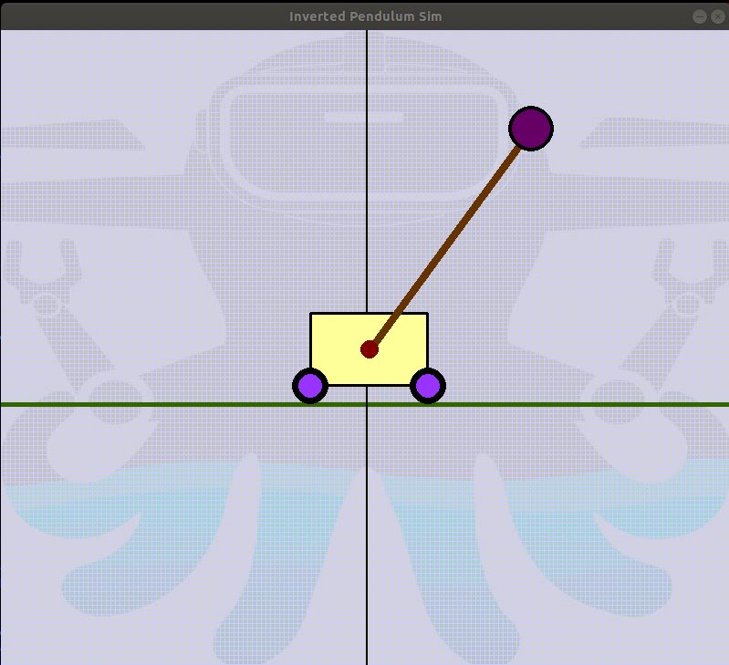

# Octobotics Coding Assignment

This Github repository provides a base inverted pendulum simulation to be used as-is for the purposes of this assignment



### Dependencies

- [`pygame`](https://pypi.org/project/pygame/)

```bash
pip install pygame
```

- [`rospy`](http://wiki.ros.org/rospy)
- [`catkin_tools`](https://catkin-tools.readthedocs.io/en/latest/installing.html)

```bash
sudo apt-get install python3-catkin-tools
```

### Usage

- clone the repository

```bash
git clone git@github.com:octobotics/Octobotics_Coding_Assignment.git
```

- navigate to the repository directory

```bash
cd Octobotics_Coding_Assignment
```

- build the project

```bash
catkin build
```
- source the workspace

```bash
source devel/setup.bash
```

- launch the simulation using roslaunch

```bash
roslaunch inverted_pendulum_sim inverted_pendulum_sim.launch
```

### Published Topics
- /inverted_pendulum/current_state ([inverted_pendulum_sim/CurrentState](https://github.com/octobotics/Octobotics_Coding_Assignment/blob/main/src/inverted_pendulum_sim/msg/CurrentState.msg)) - Publishes the current state of the inverted pendulum at 100 Hz
 
### Subscribed Topics
- /inverted_pendulum/control_force ([inverted_pendulum_sim/ControlForce](https://github.com/octobotics/Octobotics_Coding_Assignment/blob/main/src/inverted_pendulum_sim/msg/ControlForce.msg)) - Subscribes to the control force input to the inverted pendulum

### Services
- /inverted_pendulum/set_params ([inverted_pendulum_sim/SetParams](https://github.com/octobotics/Octobotics_Coding_Assignment/tree/main/src/inverted_pendulum_sim/src) - Sets the parameters and initial conditions of the inverted pendulum
